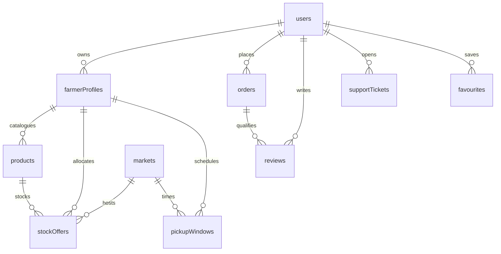

# Gather & Grow — Complete Website & Functionality Documentation
**Project:** MarketLink / Gather & Grow (eGreen Basket)  
**Edition:** TechWiz 7 — End to End Web Solutions  
**Document Type:** Comprehensive Technical & Functional Website Reference  
**Date:** September 2026  
**Repository:** [github.com/zoaibahmed/techwiz-project](https://github.com/zoaibahmed/techwiz-project)  
**Live Deployment:** `http://84.247.164.10:5050/`  

---

## Table of Contents

1. [Executive Summary & Purpose](#1-executive-summary--purpose)
2. [User Roles & Authorization Matrix](#2-user-roles--authorization-matrix)
3. [Global Discovery & Public Website](#3-global-discovery--public-website)
   - 3.1 Homepage & Interactive Storytelling
   - 3.2 Market Directory, Maps & Operating Schedules
   - 3.3 Grower Directory & Farmstead Stall Pages
   - 3.4 Produce Shelf Catalogue & Filtering Engine
   - 3.5 Product Detail Page & Favourites Toggle
   - 3.6 Information, Contact & Support Pages
4. [Customer Journey & Workspaces](#4-customer-journey--workspaces)
   - 4.1 Registration, Password Strength & OTP Verification
   - 4.2 Customer Dashboard
   - 4.3 Market Day Planner & Pickup Passport
   - 4.4 Basket & Reservation Checkout Engine
   - 4.5 Order Lifecycle, Status Transitions & Pickup Flow
   - 4.6 Favourites, Restock Notifications & Verified Reviews
   - 4.7 Direct Messaging with Farmers
   - 4.8 Customer Support Ticketing
5. [Farmer Workspace & Workflows](#5-farmer-workspace--workflows)
   - 5.1 Grower Onboarding Application & Approval State
   - 5.2 Market Day Workbench & Operations Center
   - 5.3 Produce Catalogue & Product Management
   - 5.4 Dated Stock Allocation & Price Benchmarking
   - 5.5 Recurring Weekly Stock Templates
   - 5.6 Pickup Windows, Capacity & Order Cutoffs
   - 5.7 Incoming Orders Queue & Collection Station
   - 5.8 Market Participation Requests
   - 5.9 Customer Feedback & Farmer Replies
   - 5.10 Direct Customer Chat & Support
   - 5.11 Sales Insights & Exportable Reports
6. [Administrator Command Centre & Operations](#6-administrator-command-centre--operations)
   - 6.1 Command Centre Overview & Metrics
   - 6.2 Farmer Application Reviews (Approval / Rejection with Reasons)
   - 6.3 Customer Management & Status Controls
   - 6.4 Market Venue Management & Geo-Coordinates
   - 6.5 Category Taxonomy Management
   - 6.6 Listing & Review Moderation Engine
   - 6.7 Platform Announcements Management
   - 6.8 Administrator Support Desk & Thread Resolution
   - 6.9 Conversation Audit & ID Inspection
   - 6.10 Global Reports & CSV Data Exports
7. [Dual Support & Real-Time Messaging Systems](#7-dual-support--real-time-messaging-systems)
   - 7.1 Direct Peer-to-Peer Chat (Customer ↔ Farmer)
   - 7.2 Formal Support Desk Tickets (User ↔ Admin)
   - 7.3 Public Contact Inquiries & SMTP Auto-Response
8. [Artificial Intelligence & Dashboard Copilots](#8-artificial-intelligence--dashboard-copilots)
   - 8.1 Architecture & Security Rules
   - 8.2 Public Market Guide (Visitor Assistant)
   - 8.3 Role-Specific Copilots (Customer, Farmer, Admin)
   - 8.4 Two-Phase Safe Action Previews & Confirmations
   - 8.5 Complete 53 Declared Capabilities Reference Table
9. [Database Design, Schema & Relationships](#9-database-design-schema--relationships)
   - 9.1 Data Design Principles
   - 9.2 Core Collections Reference (19 Collections)
   - 9.3 Entity Relationship Map
   - 9.4 Indexes & Constraints
10. [Technical Architecture & Data Flows](#10-technical-architecture--data-flows)
    - 10.1 Multi-Tier Stack Architecture
    - 10.2 Discovery Data Flow
    - 10.3 Reservation & Stock Consistency Data Flow
    - 10.4 Administration & Audit Data Flow
    - 10.5 AI Copilot Data Flow
11. [Design System, Aesthetics & Accessibility](#11-design-system-aesthetics--accessibility)
    - 11.1 Palette & Rule: NO GRADIENTS
    - 11.2 Typography & Spacing Scale
    - 11.3 Responsive Layouts & Mobile Navigation
12. [Installation, Configuration & Deployment](#12-installation-configuration--deployment)
    - 12.1 Prerequisites
    - 12.2 Environment Variables Breakdown
    - 12.3 Database Restoration & Seed Script
    - 12.4 Running Local Development Servers
    - 12.5 Building for Production
13. [Verification, Test Coverage & Honest Limitations](#13-verification-test-coverage--honest-limitations)
14. [Additional Features Beyond the Official SRS (19 Extensions)](#14-additional-features-beyond-the-official-srs-19-extensions)

---

## 1. Executive Summary & Purpose

**Gather & Grow** (internally designated as *MarketLink* / *eGreen Basket*) is a full-stack, enterprise-grade digital marketplace platform built to bridge the gap between local growers (farmers) and consumers (customers). 

### The Core Problem Solved
Traditional farmers' markets suffer from information asymmetry:
1. Customers arrive at physical markets without knowing whether their desired produce is in season, which farmers are attending, or whether stock has already sold out.
2. Farmers pack inventory on speculation without knowing true customer demand, leading to food waste, unreserved leftovers, and logistical chaos.
3. Informal pre-ordering via messaging apps or paper slips lacks stock control, pickup scheduling, and accountability.

### The Gather & Grow Solution
Gather & Grow solves this through a **reservation-first, collect-and-pay-in-person model**:
- **Advance Discovery:** Customers browse verified local markets, attending farmsteads, and real-time dated produce listings.
- **Guaranteed Reservations:** Customers reserve exact quantities within published farmer stock limits and select designated collection time windows.
- **Physical In-Person Settlement:** There is **NO online payment gateway or delivery logistics**. Customers collect fresh produce directly from the farmer's stall and pay in cash or direct physical point-of-sale.
- **Grower Empowerment:** Farmers receive pre-committed orders days before market day, plan crate harvesting accurately, and operate a digital collection queue at their stall.
- **Platform Governance:** Administrators oversee market venues, approve grower applications, moderate content, resolve support tickets, and review platform-wide analytics.

---

## 2. User Roles & Authorization Matrix

The platform implements role-based access control (RBAC) enforced strictly at both the client route level and backend API middleware level.

| Role | Primary Purpose | Scope & Access Boundary |
| :--- | :--- | :--- |
| **Anonymous Visitor** | Browses public catalogue, reads market details, learns about growers, uses Public Market Guide, and submits contact inquiries. | Read-only access to published records; no cart reservations or private messaging. |
| **Customer** | Discovers produce, builds market baskets, places reservations, tracks pickup passports, manages favourites, chats with farmers, writes reviews, and opens support tickets. | Restricted to own orders, personal profile, saved items, and active conversations. |
| **Farmer (Grower)** | Manages farmstead profile, catalogues produce, publishes dated stock, creates pickup windows, processes incoming orders, manages venue requests, and reviews analytics. | Full control over own products and inventory; cannot view or edit competing growers' data. Access to selling tools requires administrator approval. |
| **Administrator** | Superintends platform health, verifies and approves farmer applications, creates markets and categories, moderates reviews, broadcasts announcements, and resolves support tickets. | Complete system governance, tenant management, and platform audit logs. |

---

## 3. Global Discovery & Public Website

### 3.1 Homepage & Interactive Storytelling
- **Location Selector & Regional Context:** Visitors select their Country and City from a curated international network (10 countries, 40 cities, 80 markets). The catalogue instantly recalibrates to display relevant local venues and growers.
- **Editorial Brand Aesthetic:** Built with the Gather & Grow design language featuring solid colors (`#163626` Forest, `#F5F1E8` Ivory, `#242724` Ink, `#E1E8DC` Sage), zero gradients, Newsreader serif headings, and Public Sans typography.
- **Section Progression:**
  1. *Hero Scene:* Location switcher, market-day quick selection, and call-to-action buttons.
  2. *Start Here (Three Steps):* Explains the model: (1) Choose a market, (2) Reserve produce online, (3) Collect and pay at pickup.
  3. *Market Explorer:* Visual browsing of active community markets.
  4. *Market Announcement Banner:* Surfaces live administrator notices.
  5. *Harvest Index:* Interactive category browser showing listed produce count.
  6. *Market Journey:* Multi-step journey explaining the farm-to-crate transition.
  7. *Market Pulse:* Live metrics displaying operating venues, verified growers, and available produce.
  8. *Copilot Showcase:* Demonstrates conversational assistance for shoppers.

### 3.2 Market Directory, Maps & Operating Schedules (`/markets` & `/markets/:marketId`)
- **Venue Discovery:** Filter markets by city, area, neighbourhood search, and market day.
- **Interactive OpenStreetMap Maps:** Embedded Leaflet-powered maps show geographic venue pins without requiring proprietary paid Google Maps API keys.
- **Market Detail Page:** Displays full address, operating day of week, hours, local timezone, participating farmers list, and all produce available at that specific venue. Includes an integrated direction link.

### 3.3 Grower Directory & Farmstead Stall Pages (`/farmers` & `/farmers/:farmerId`)
- **Meet the Producers:** Directory of approved farmsteads with profile photography, farm location, bio, and badge indicators.
- **Stall Experience:** Detailed stall page showcasing the farm story, location pin, participating market venues, current seasonal harvest, customer ratings, verified reviews, and farmer replies.
- **Direct Messaging Trigger:** Authenticated customers can launch a direct chat thread with the farmer directly from their stall header.

### 3.4 Produce Shelf Catalogue & Filtering Engine (`/produce` or `/products`)
- **Multi-Faceted Filtering:**
  - Full-text search across item names, varieties, and descriptions.
  - Custom Category Dropdown with real-time stock counters.
  - Custom Market Venue Dropdown.
  - Custom Grower Dropdown.
  - Sorting options: Name (A-Z), Price (Low to High / High to Low), and Availability.
- **Real-Time Stock Counters:** Displays active inventory levels (e.g., "18 of 40 left · Selling fast" with visual inventory meters).
- **Responsive Shelf Cards:** Product cards with smooth entrance micro-transitions, stock status badges (*Selling Fast*, *Sold Out*, *Unavailable*), direct product links, and quick-add to market basket.

### 3.5 Product Detail Page & Favourites Toggle (`/products/:productId`)
- **High-Fidelity Product Presentation:** Comprehensive product photo, grower eyebrow link, selling unit (e.g., `/kg`, `/box`, `/bunch`), pricing, and description.
- **Location & Market Association:** Clearly displays the pickup market, address, and upcoming collection dates.
- **Interactive Favourites Pill Button:** Heart icon with live state toggle (`"Save to favourites"` / `"Saved in favourites"`). Preserves redirection URLs for unauthenticated visitors so logging in returns them immediately to the product.
- **Restock Alert Subscription:** Allows customers to subscribe to notifications when an out-of-stock item is replenished for a future market day.

### 3.6 Information, Contact & Support Pages
- **About Us (`/about`):** Details the mission, zero-commission grower ethos, and sustainable food principles.
- **How It Works (`/help`):** Comprehensive FAQ explaining reservation cutoffs, in-person cash payments, pickup windows, and farmer interaction.
- **Contact Form (`/contact`):** Validated contact form (Name, Email, Subject, Message) backed by automated server-side email forwarding to the administration desk and automatic confirmation reply to the sender.

---

## 4. Customer Journey & Workspaces

### 4.1 Registration, Password Strength & OTP Verification
- **Dual Registration Paths:** Direct choice between Customer (`/register/customer`) and Grower (`/register/farmer`).
- **Interactive Password Guidance:** Evaluates 4 requirements (12+ characters, uppercase & lowercase, at least one number, at least one special symbol). Enforces 72-byte hashing limits.
- **Two-Factor Email Verification:** Sends a secure 6-digit OTP code with a 10-minute expiry window. Accounts are only activated upon successful code verification.
- **Password Reset:** Self-service reset using email verification codes.

### 4.2 Customer Dashboard (`/customer`)
- **Action-Oriented Overview:** Quick view of upcoming pickups, active reservations, recent order statuses, and quick links to favourite stalls.
- **Navigation Rails:** Clean desktop sidebar and mobile sliding drawer giving access to Market Day Planner, Orders, Favourites, Messages, Notifications, Support, and Profile.

### 4.3 Market Day Planner & Pickup Passport (`/customer/market-day`)
- **Market Day Planner:** Aggregates all orders scheduled for a specific date, mapping out pickup windows across multiple farmers to help customers plan their morning market route efficiently.
- **Pickup Passport (`/customer/orders/:orderId`):** An order reference view presenting order number, pickup window, grower name, stall location, item breakdown, and total cash due at the stall.

### 4.4 Basket & Reservation Checkout Engine (`/basket` & `/checkout`)
1. **Grower Grouping:** Basket automatically segments items by grower, because each farmstead packages its own produce independently.
2. **Pickup Window Selection:** For each farmer group, the customer selects an available pickup window (e.g., `09:00 AM - 10:00 AM`) for the designated market date.
3. **Cutoff & Capacity Checks:** Checkout verifies that:
   - The order cutoff time has not passed.
   - The selected pickup window has remaining vehicle/shopper capacity.
   - The requested product quantity is still available in dated stock.
4. **Reservation Confirmation:** Creates formal order records in `placed` status. No card numbers or banking data are solicited; total due is clearly stated as payable upon collection.

### 4.5 Order Lifecycle, Status Transitions & Pickup Flow
```
[ Customer Places Reservation ]
             │
             ▼
        ( placed )
       /          \
( Farmer Accepts )  ( Farmer Declines - with reason )
     │                     │
     ▼                     ▼
 ( accepted )          ( declined - stock released )
     │
( Farmer Prepares )
     │
     ▼
( ready_for_pickup )
     │
( Customer Collects & Pays Cash )
     │
     ▼
 ( completed ) ──▶ [ Eligible for Review ]
```
- **Customer Cancellation:** Orders in `placed` status can be cancelled by the customer prior to the cutoff deadline, automatically releasing reserved stock back to the farmer's inventory.
- **Customer Order Modification:** Quantities can be adjusted before farmer acceptance subject to real-time stock limits.

### 4.6 Favourites, Restock Notifications & Verified Reviews
- **Favourites Hub (`/customer/favourites`):** Tabbed interface organizing saved Products, Farmers, and Markets for quick 1-click access.
- **Restock Notifications:** Alerts triggered automatically when a farmer publishes fresh dated inventory for a watched item.
- **Verified Order Reviews (`/customer/orders/:orderId/review`):** Only customers who have completed an order can submit a 1-to-5 star rating and written review. Prevents fake reviews and spam.

### 4.7 Direct Messaging with Farmers (`/customer/messages`)
- Direct private messaging thread between the customer and the grower.
- Features include unread count badges, timestamps, message status, and archiving.

### 4.8 Customer Support Ticketing (`/customer/support`)
- Full ticketing system allowing customers to submit issues directly to platform administrators.
- Supports ticket references (e.g., `#TICK-1042`), message history, administrative responses, and resolution status (Open / Closed).

---

## 5. Farmer Workspace & Workflows

### 5.1 Grower Onboarding Application & Approval State (`/farmer/onboarding`)
- **Step 1 — Identity & Business Details:** Farm business name, contact person, verified phone, registered farmstead address.
- **Step 2 — Story & Practices:** Farm background, farming methods, organic/sustainable practices description.
- **Step 3 — Stall Location Pin:** Map-based pin placement defining the home farm location.
- **Application Review States:**
  - `Draft`: Grower is preparing information.
  - `Submitted / Pending`: Submitted to the administrator for review.
  - `Returned / Action Required`: Administrator requested corrections with specific feedback.
  - `Approved`: Full selling privileges granted.
  - `Suspended`: Temporarily disabled by administrator.

### 5.2 Market Day Workbench & Operations Center (`/farmer`)
- The grower's cockpit on market morning: displays total reservations for today, total crates to harvest, collection window progress, and order queue status.

### 5.3 Produce Catalogue & Product Management (`/farmer/products`)
- **Master Listing Creator:** Form to define item title, category taxonomy, selling unit, base price, detailed description, and image URL.
- **Catalogue Maintenance:** Edit details, update descriptions, and archive discontinued crops without breaking historical order snapshots.

### 5.4 Dated Stock Allocation & Price Benchmarking (`/farmer/stock`)
- **Occasion-Specific Inventory:** Farmers assign stock to specific upcoming market dates and venues (e.g., 40 kg of Desi Tomatoes for Sunday, Oct 4th at Lahore Organic Market).
- **Stock Safeguards:** Prevents farmers from accidentally lowering published stock below already-confirmed customer reservations.
- **Price Benchmarking Widget:** Compares the grower's unit price against the market catalogue average for that category to support competitive pricing.

### 5.5 Recurring Weekly Stock Templates (`/farmer/stock-templates`)
- Pre-save regular harvest routines (e.g., standard weekly packing list: 50 kg potatoes, 30 boxes strawberries, 20 jars honey) and apply them to future dates with 1 click.

### 5.6 Pickup Windows, Capacity & Order Cutoffs (`/farmer/pickup-windows`)
- Define distinct pickup slots (e.g., `08:00 AM - 09:30 AM`, `09:30 AM - 11:00 AM`).
- Set slot capacity (maximum reservations allowable in that window).
- Define order cutoffs (e.g., orders must be placed 24 hours prior to market start).

### 5.7 Incoming Orders Queue & Collection Station (`/farmer/orders` & `/farmer/pickups`)
- **Queue Actions:** 1-click Accept, Decline (with prompt for cancellation reason), and Mark Ready for Pickup.
- **Collection Station:** Clean tablet/mobile-friendly interface for the farmer at the stall to look up customer names/order IDs, verify crates, and mark as Completed upon receiving physical cash payment.

### 5.8 Market Participation Requests (`/farmer/markets`)
- Farmers request attendance at approved community market venues in their region. Administrators review and grant stall approval per venue.

### 5.9 Customer Feedback & Farmer Replies (`/farmer/reviews`)
- Read verified customer reviews and post public replies to build community trust.

### 5.10 Direct Customer Chat & Support (`/farmer/messages` & `/farmer/support`)
- Direct customer chat channel and formal support ticketing with administrators.

### 5.11 Sales Insights & Exportable Reports (`/farmer/reports`)
- Visual breakdown of unit sales by product, total booked reservation volume, pickup completion rates, and downloadable CSV exports.

---

## 6. Administrator Command Centre & Operations

### 6.1 Command Centre Overview & Metrics (`/admin`)
- Real-time pulse of platform health: pending grower applications, open support tickets, total active markets, registered customers, and aggregate platform activity.

### 6.2 Farmer Application Reviews (`/admin/farmers` & `/admin/farmers/:farmerId`)
- Full application review modal displaying identity, phone, address, farming methods, and location pin.
- One-click **Approve**, **Return with Feedback** (requires detailed explanation message), or **Suspend**.

### 6.3 Customer Management & Status Controls (`/admin/customers`)
- Directory of registered customers with activation toggle (Active / Suspended) and order history audit links.

### 6.4 Market Venue Management & Geo-Coordinates (`/admin/markets`)
- Create and edit market venues: Name, Address, City, Country, Latitude/Longitude pin, Operating Days of Week, Opening/Closing Hours, Timezone, and Local Currency.

### 6.5 Category Taxonomy Management (`/admin/categories`)
- Create and manage master produce categories (Vegetables, Fruits, Dairy, Bakery, Preserves, Herbs, etc.) with category slugging.

### 6.6 Listing & Review Moderation Engine (`/admin/moderation`)
- Review reported items, inspect inappropriate review comments, and toggle listing visibility across the public site.

### 6.7 Platform Announcements Management (`/admin/announcements`)
- Publish site-wide emergency notices, seasonal market date changes, or weather warnings. Manage active vs. archived states.

### 6.8 Administrator Support Desk & Thread Resolution (`/admin/support`)
- Centralized ticket inbox for both customer and farmer inquiries. Search by ticket ID or subject, reply in-thread, and close resolved issues.

### 6.9 Conversation Audit & ID Inspection (`/admin/inquiries`)
- Authorised compliance tool enabling administrators to look up a customer-farmer thread by Conversation ID to investigate disputes or fraud.

### 6.10 Global Reports & CSV Data Exports (`/admin/reports`)
- Comprehensive platform analytics: reservations by city, top-performing venues, grower participation counts, and 1-click CSV report exports.

---

## 7. Dual Support & Real-Time Messaging Systems

The application maintains a deliberate, clean architectural distinction between **Direct Chat** and **Support Tickets**:

```
┌─────────────────────────────────────────────────────────────┐
│                   COMMUNICATION ARCHITECTURE                │
├──────────────────────────────┬──────────────────────────────┤
│    DIRECT PEER-TO-PEER CHAT  │    FORMAL SUPPORT TICKETS    │
│    (Customer ↔ Farmer)       │    (Customer/Farmer ↔ Admin) │
├──────────────────────────────┼──────────────────────────────┤
│ • Pre-order inquiries        │ • Account verification issues│
│ • Custom crate requests      │ • Farmer application appeals │
│ • Stall directions & meetup  │ • Platform bugs / disputes   │
│ • Stored in `conversations`  │ • Stored in `supportTickets` │
│ • Conversation ID            │ • Ticket Ref (e.g. #TCK-104) │
└──────────────────────────────┴──────────────────────────────┘
```

### Public Contact Form Integration
When an anonymous visitor submits the `/contact` form:
1. An inquiry record is created in `contactInquiries`.
2. The server sends an automated notification email to the configured administrator inbox (`EMAIL_FROM`).
3. An automated acknowledgement email is dispatched to the visitor's email address confirming receipt.

---

## 8. Artificial Intelligence & Dashboard Copilots

### 8.1 Architecture & Security Rules
- **Server-Side Exclusive:** All OpenAI API keys, system prompts, and context preparation reside exclusively on the Node.js backend. Zero keys are exposed to the client bundle.
- **Independent Fallbacks:** The entire application functions 100% normally if the AI service is disabled or offline.
- **No Hallucinated Actions:** Write actions cannot execute autonomously; they generate an `aiActionDrafts` record for human preview and explicit confirmation.

### 8.2 Public Market Guide (Visitor Assistant)
- Floats as a discreet concierge button on public pages.
- Answers questions regarding market venues, attending growers, catalogue pricing, and pickup policies.
- Can guide visitors through submitting a contact form inquiry directly within the conversational window.

### 8.3 Role-Specific Copilots
- **Customer Market Companion:** Recommends seasonal produce recipes, checks order pickup times, finds nearby stalls, and drafts reservation checklists.
- **Farmer Farm Copilot:** Analyzes low-stock warnings, proposes recurring stock template allocations, and drafts customer replies.
- **Admin Market Intelligence:** Summarizes pending farmer applications, flags unassigned venues, and extracts platform metric summaries.

### 8.4 Two-Phase Safe Action Previews & Confirmations
For any consequential database change proposed by the AI:
1. **Phase 1 (Drafting):** The AI presents a clear "Before vs. After" visual diff and generates a temporary draft token.
2. **Phase 2 (Confirmation):** The user clicks "Confirm & Apply". The backend re-validates the user's role, permissions, and current record state before executing the write.

### 8.5 Complete 53 Declared Capabilities Reference Table

| Scope | Capability Name | Action Type | Confirmation Required? | Declared Functionality |
| :--- | :--- | :--- | :--- | :--- |
| **Public** | `catalogue_search` | Read | No | Searches produce items by keyword and category |
| **Public** | `market_finder` | Read | No | Finds venues matching city, day, or geolocation |
| **Public** | `grower_lookup` | Read | No | Retrieves farmer profile and attending markets |
| **Public** | `pickup_policy_info` | Read | No | Explains cash payment and collection windows |
| **Public** | `contact_inquiry_submit` | Write | Yes | Submits a validated visitor contact message |
| **Customer** | `view_orders` | Read | No | Queries customer reservation history and statuses |
| **Customer** | `check_pickup_details` | Read | No | Retrieves time window and market address for an order |
| **Customer** | `list_favourites` | Read | No | Displays saved growers, markets, and produce |
| **Customer** | `add_favourite` | Write | No | Saves an item to customer favourites |
| **Customer** | `remove_favourite` | Write | No | Removes an item from customer favourites |
| **Customer** | `set_restock_alert` | Write | No | Subscribes to stock alert on out-of-stock items |
| **Customer** | `remove_restock_alert`| Write | No | Unsubscribes from a restock alert |
| **Customer** | `cancel_order` | Write | Yes | Cancels an eligible reservation before cutoff |
| **Customer** | `reorder_items` | Write | Yes | Pre-fills basket with items from a past order |
| **Customer** | `search_recipes` | Read | No | Suggests recipes based on seasonal catalogue items |
| **Customer** | `view_notifications` | Read | No | Lists unread account and order notices |
| **Customer** | `mark_notification_read`| Write | No | Updates notification status to read |
| **Customer** | `check_market_weather`| Read | No | Provides weather advisories for market days |
| **Farmer** | `get_workbench_summary`| Read | No | Summarizes today's reservations and prep tasks |
| **Farmer** | `list_incoming_orders`| Read | No | Queries orders filtered by status or market date |
| **Farmer** | `accept_order` | Write | Yes | Accepts an incoming customer reservation |
| **Farmer** | `decline_order` | Write | Yes | Declines reservation with mandatory reason |
| **Farmer** | `mark_order_ready` | Write | Yes | Signals that crates are packed and ready |
| **Farmer** | `complete_order` | Write | Yes | Confirms pickup and cash settlement |
| **Farmer** | `list_products` | Read | No | Displays grower's own produce listings |
| **Farmer** | `create_product` | Write | Yes | Drafts a new produce catalogue entry |
| **Farmer** | `update_product` | Write | Yes | Edits title, description, unit, or price |
| **Farmer** | `archive_product` | Write | Yes | Deactivates a product listing safely |
| **Farmer** | `get_dated_stock` | Read | No | Checks published vs. reserved quantities |
| **Farmer** | `update_dated_stock` | Write | Yes | Adjusts quantities for a specific market date |
| **Farmer** | `list_pickup_windows` | Read | No | Displays active windows for upcoming sessions |
| **Farmer** | `create_pickup_window`| Write | Yes | Creates time slot with capacity and cutoff |
| **Farmer** | `update_pickup_window`| Write | Yes | Modifies slot times or cutoff parameters |
| **Farmer** | `apply_stock_template`| Write | Yes | Populates future market stock from weekly template |
| **Farmer** | `compare_prices` | Read | No | Calculates category average unit pricing |
| **Farmer** | `draft_reply_to_chat` | Read | No | Suggests a courteous reply to customer message |
| **Farmer** | `view_reviews` | Read | No | Retrieves verified ratings and customer comments |
| **Farmer** | `reply_to_review` | Write | Yes | Publishes official farmer response to a review |
| **Farmer** | `get_sales_analytics` | Read | No | Summarizes reservation totals and popular items |
| **Admin** | `get_platform_metrics`| Read | No | Summarizes system-wide user, order, and venue counts |
| **Admin** | `list_pending_farmers`| Read | No | Displays pending grower onboarding submissions |
| **Admin** | `approve_farmer` | Write | Yes | Grants approved selling privileges to a grower |
| **Admin** | `return_farmer_app` | Write | Yes | Returns application with required correction notes |
| **Admin** | `suspend_farmer` | Write | Yes | Temporarily revokes grower selling access |
| **Admin** | `list_venue_requests` | Read | No | Shows pending farmer requests to attend markets |
| **Admin** | `decide_venue_request`| Write | Yes | Approves or declines market attendance request |
| **Admin** | `create_market` | Write | Yes | Sets up a new community market venue |
| **Admin** | `update_market` | Write | Yes | Modifies venue schedule, pin, or timezone |
| **Admin** | `manage_category` | Write | Yes | Adds or renames master catalogue categories |
| **Admin** | `moderate_review` | Write | Yes | Hides or restores reported customer reviews |
| **Admin** | `broadcast_notice` | Write | Yes | Publishes platform-wide announcement banner |
| **Admin** | `inspect_conversation`| Read | Yes | Audits customer-farmer thread by Conversation ID |
| **Admin** | `resolve_ticket` | Write | Yes | Updates support ticket status to Closed |

---

## 9. Database Design, Schema & Relationships

### 9.1 Data Design Principles
- **MongoDB Native Extended JSON:** Leverages MongoDB document collections with strict schema validation.
- **Minor Monetary Units:** All currency values are stored as integers in minor units (e.g., Pakistani Rupee `PKR 180` = `18000` paise/cents) alongside an ISO currency code to eliminate floating-point rounding errors.
- **Separate Market Dates & Pickup Times:** Dates are stored as ISO calendar dates (`YYYY-MM-DD`) distinct from local clock times (`HH:mm`), preserving timezone integrity across venues.
- **GeoJSON Standard:** Coordinates are stored in standard `[longitude, latitude]` GeoJSON Point geometry.

### 9.2 Core Collections Reference (19 Collections)



1. **`users`:** Core identity record storing email, password hash, role (`customer`, `farmer`, `admin`), full name, phone, account activation status, and timestamps.
2. **`farmerProfiles`:** Grower business profile linked 1:1 with `userId`. Stores business name, contact person, story/bio, farmstead address, GeoJSON point, approved market IDs, and application status (`draft`, `submitted`, `approved`, `returned`, `suspended`).
3. **`markets`:** Community market venues. Stores venue name, address, city, country, GeoJSON coordinates, operating day, opening/closing hours, IANA timezone, currency code, and active state.
4. **`categories`:** Produce taxonomy. Stores category title, URL slug, and active status.
5. **`products`:** Individual produce catalogue items. Stores `farmerId`, `categoryId`, title, selling unit, base price, description, photo URL, and visibility status.
6. **`stockOffers`:** Dated inventory allocations. Compound record referencing `farmerId`, `marketId`, `productId`, and calendar `date`. Stores `publishedUnits`, `reservedUnits`, unit price, and availability flag.
7. **`pickupWindows`:** Collection slots. Stores `farmerId`, `marketId`, calendar `date`, startTime, endTime, reservation capacity limit, and cutoff timestamp.
8. **`orders`:** Customer reservations. Stores order number, `customerId`, `farmerId`, `marketId`, calendar `date`, `pickupWindowId`, items snapshot array (product title, quantity, price, unit), order status (`placed`, `accepted`, `ready_for_pickup`, `completed`, `declined`, `cancelled`), and status history log.
9. **`reviews`:** Verified ratings and feedback. Stores `orderId`, `customerId`, `farmerId`, optional `productId`, 1-to-5 star score, comment, farmer reply text, and moderation status.
10. **`favourites`:** Saved preferences linking `userId` to target `id` and target type (`product`, `farmer`, `market`).
11. **`restockAlerts`:** Subscriptions linking `userId`, `productId`, and `marketId` for availability alerts.
12. **`weeklyStockTemplates`:** Pre-configured recurring inventory lists for farmers.
13. **`conversations`:** Peer-to-peer chat threads linking customer and farmer participant IDs.
14. **`messages`:** Individual chat messages linked to `conversationId` with sender ID, text, timestamps, and read indicators.
15. **`supportTickets`:** Formal support tickets linking owner `userId`, ticket reference, category, subject, status (`open`, `resolved`, `closed`), and message thread.
16. **`announcements`:** Platform-wide broadcasts with title, body, priority, publish date, and archive status.
17. **`contactInquiries`:** Public contact form submissions with name, email, subject, message body, and admin reply status.
18. **`aiActionDrafts`:** Temporary two-phase action proposals storing user ID, action name, payload, preview diff, expiry timestamp, and execution state.
19. **`auditLogs`:** Immutable administrative audit logs recording actor ID, action type, target entity, and timestamp.

---

## 10. Technical Architecture & Data Flows

### 10.1 Multi-Tier Stack Architecture
- **Presentation Layer (Frontend):** React 19, TypeScript, Vite, React Router 7, Framer Motion, and CSS custom properties design tokens.
- **Client State & API Client:** Centralized HTTP transport (`gateway.ts` and `api.ts`) managing credentialed requests, CSRF token handling, and synchronization.
- **API & Application Layer (Backend):** Node.js 22+, Express, JWT cookie session authentication, express-rate-limit, and Joi/Zod schema validation.
- **Database Layer:** MongoDB with native driver connection pooling, compound indexing, and ACID multi-document transactions where required.

### 10.2 Discovery Data Flow
```
Visitor Browser ──▶ GET /api/v1/discovery?city=Lahore&day=Sunday
                          │
                   Express Controller
                          │
          MongoDB Aggregation:
          • Markets in Lahore
          • Approved Farmers attending those markets
          • Active Products & Dated Stock Offers
                          │
Visitor Browser ◀── JSON Payload (Authoritative Active Records)
```

### 10.3 Reservation & Stock Consistency Data Flow
```
Customer Checkout ──▶ POST /api/v1/orders (basket items, windowId)
                             │
                     Order Service:
                     1. Verify cutoff time > now
                     2. Verify window capacity > current reservations
                     3. Atomic check: stockOffer.published - stockOffer.reserved >= requested
                             │
              [ Passed? ] ───┴─── [ Failed? ]
                   │                     │
                   ▼                     ▼
           Update stockOffers:      HTTP 409 Conflict:
           reserved += quantity     "Insufficient stock for Desi Tomatoes"
                   │
           Insert orders record
                   │
Customer ◀── HTTP 201 Created (Order Placed)
```

---

## 11. Design System, Aesthetics & Accessibility

### 11.1 Palette & Master Rule: NO GRADIENTS
In strict compliance with modern luxury software aesthetics and user preferences:
- **NO GRADIENTS ANYWHERE:** No CSS gradients, no linear/radial overlays, no gradient text, and no gradient buttons.
- **Solid Luxury Palette:**
  - `Forest Deep` (`#163626` / `#1E3F2E`): Primary brand, navigation bars, solid action buttons.
  - `Harvest Gold` (`#BE9145` / `#946E2E`): Restrained accents, highlights, active tags.
  - `Ivory Background` (`#F7F8F2` / `#FFFFFF`): Clean surfaces, crisp card backings.
  - `Sage Muted` (`#51754A` / `#C4CFBD`): Subtle borders, dividers, badge backgrounds.
  - `Ink Typography` (`#172C20` / `#263E2E`): High-contrast readable body text.

### 11.2 Typography & Spacing Scale
- **Display Headings:** *Newsreader* (Google Fonts serif) for elegant, editorial presentation.
- **Interface & Operational Text:** *Public Sans* for clean tabular alignment, forms, and dense dashboard tables.

### 11.3 Responsive Layouts & Mobile Navigation
- Dedicated mobile navigation drawer with touch-friendly links, explicit close triggers, and sign-out controls.
- Responsive data tables that gracefully convert into card-based layouts on screens under 768px.
- Full support for `prefers-reduced-motion` to disable animations for sensitive users.

---

## 12. Installation, Configuration & Deployment

### 12.1 Prerequisites
- **Node.js:** Version 22.12.0 or newer.
- **npm:** Version 10 or newer.
- **MongoDB:** Version 7.0 or newer (or MongoDB Atlas cluster).

### 12.2 Environment Variables Breakdown (`Server/.env`)
```bash
# Server & Port
PORT=5000
NODE_ENV=production
CLIENT_ORIGIN=http://localhost:5173

# Database Connection
MONGODB_URI=mongodb://localhost:27017
MONGODB_DB_NAME=techwiz_marketlink

# Security & Sessions
JWT_SECRET=super_secret_production_jwt_signing_key_at_least_32_characters
JWT_EXPIRES_IN=7d
COOKIE_SECRET=super_secret_cookie_signing_key

# Email Transport (Nodemailer for OTP & Contact Form)
EMAIL_USER=notifications@yourdomain.com
EMAIL_APP_PASSWORD=your_app_specific_email_password
EMAIL_FROM="Gather & Grow <notifications@yourdomain.com>"
ADMIN_NOTIFICATION_EMAIL=admin@yourdomain.com

# Optional Artificial Intelligence
OPENAI_API_KEY=sk-proj-...
OPENAI_MODEL=gpt-4o-mini

# Regional Defaults
DEFAULT_CURRENCY=PKR
DEFAULT_TIMEZONE=Asia/Karachi
```

### 12.3 Database Restoration
The canonical database dump is supplied in Extended JSON format:
```bash
cd Server
node scripts/restore-submission.mjs "D:/final-techwiz/final-techwiz/techwiz-project/Submission/MarketLink/Database File/MarketLink.ejson"
```

### 12.4 Running Local Development Servers
```bash
# Terminal 1: Backend API Server
cd Server
npm install
npm run dev

# Terminal 2: Frontend Client
cd Client
npm install
npm run dev
```

### 12.5 Building for Production
```bash
cd Client
npm run build
# Produces optimized dist/ bundle verified with zero TypeScript errors.
```

---

## 13. Verification, Test Coverage & Honest Limitations

### Verification Evidence
- **Frontend Production Build:** Passed with zero TypeScript errors (`tsc --noEmit` and Vite bundle passed).
- **Unit & Integration Test Suite:** 27 frontend tests and 38 backend tests covering cutoff checks, stock allocations, registration flows, and security filters.
- **Database Consistency:** Validated against 80 markets, 320 growers, 1,280 products, 5,120 dated stock offers, and 2,560 pickup windows.

### Honest Limitations & Disclaimers
1. **No Online Payment Gateway:** The application intentionally does not process credit cards or digital banking; all transactions are physically settled in cash at the market stall.
2. **No Delivery Logistics:** All orders are customer-collected at the physical venue.
3. **Illustrative Sample Dataset:** The 10-country international market dataset is structured for comprehensive evaluation and demonstration; venue coordinates point to central city coordinates.
4. **Email Delivery Notice:** Real SMTP dispatch depends on working mail credentials in `Server/.env`.

---

## 14. Additional Features Beyond the Official SRS (19 Extensions)

The following 19 features were engineered into Gather & Grow above and beyond the baseline requirements of the official Software Requirements Specification (SRS):

1. **Formal Support Ticketing System:** Dedicated support portal allowing customers and farmers to open referenced support tickets (`#TCK-xxx`), exchange messages with administrators, and view status history.
2. **Administrator Support Desk:** Unified support management desk for searching, filtering, answering, and closing support tickets across all user types.
3. **Direct Peer-to-Peer Chat (Customer ↔ Farmer):** Private real-time messaging threads with unread indicators, read tracking, and archiving.
4. **Compliance Conversation ID Inspection:** Authorised administrative tool enabling administrators to audit customer-farmer chat threads using conversation IDs during dispute resolutions.
5. **Farmer AI Reply Assistance:** Context-aware reply generator helping growers draft quick, professional responses to customer pre-order questions.
6. **Market Day Planner:** Dedicated interactive calendar view for shoppers to coordinate and plan multiple pickup times across different farm stalls.
7. **Pickup Passport:** Consolidated order pass showing reference ID, pickup window, grower name, stall directions, and cash total due.
8. **Farmer Market Day Workbench:** Operational cockpit for growers on market morning linking orders, crate preparation checklists, and collection queues.
9. **Market Participation Review Workflow:** Independent workflow allowing approved growers to apply for attendance at specific market venues with administrative approval.
10. **Grower Application Return & Resubmission Flow:** Allows administrators to return incomplete applications with clear correction guidance, enabling growers to fix errors without restarting.
11. **Produce Price Benchmarking Engine:** Real-time pricing comparison tool displaying category unit averages to guide farmer pricing.
12. **Three Role-Specific AI Copilots:** Tailored conversational assistants (Market Companion for shoppers, Farm Copilot for growers, Market Intelligence for administrators).
13. **Two-Phase Safe Action Confirmation:** Enforces a mandatory "Preview Diff $\rightarrow$ Human Confirmation" flow before any AI-proposed database write is executed.
14. **Guided Public Contact Concierge:** Public AI concierge capable of collecting and submitting visitor contact inquiries through dialogue.
15. **Automated Contact Forwarding & Auto-Reply:** Server-side email dispatcher sending visitor inquiries to the admin inbox with automatic acknowledgement to the sender.
16. **Interactive Password Strength Meter:** Visual requirement checklist validating 12+ characters, uppercase, lowercase, numbers, and special symbols within 72-byte limits.
17. **Global Multi-Region Discovery:** Multi-country, multi-city regional filtering engine supporting 10 countries and 40 cities with localized currencies and timezones.
18. **Period-Based CSV Analytical Exports:** Export tools across farmer and administrator reporting views generating structured CSV downloads.
19. **Original Non-Gradient Luxury Design System:** Cohesive editorial design system featuring Newsreader typography, Public Sans, custom SVG icons, and a strict no-gradient luxury visual language.
